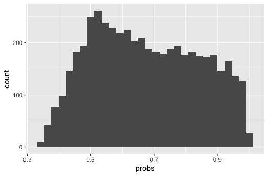

A Tidy Bayesian Workflow
================

This **tidy Bayesian workflow** details the process of conducting
Bayesian inference using tidy principles and modern tools and
diagnostics. In particular, we will employ the tidyverse for data
wrangling and visualization and Stan for modeling.

The workflow is composed of three sections: **model building**, **model
calibration**, and **model validation**. The workflow material draws
heavily from Michael Betancourt’s case studies and training on using
Stan at Drexel University in Fall 2018.

## Model Building

### Describe the Model Conceptually

A model starts conceptually: What is the data generating process? Or, in
other words, where do the data come from? This conceptual model often
lives within a literature of model building, motivated by theory, and at
its most basic may simply be a consideration of how to relax assumptions
in an existing model. Document this description, as it likely serves as
the beginning of an introduction to the project. Above all, the model
needs to be consistent with our domain expertise.

#### Example: Consumer Choice

For a running example, let’s consider consumer choice. Drawing from
economic theory, we can conceptualize the data generating process as
follows: Consumers get “utility” from different features of a product
such that they simply choose the product that gives them the most
utility overall. We can add a lot of complications to this model, but
conceptually, this is probably the simplest expression.

### Define Observations and Relevant Summary Statistics

As part of this conceptual description of the model, we should consider
the ideal dataset. We encode the information about the observations
using the `data` block in Stan. We should also consider what summary
statistics, including visualizations, would be helpful to evaluate the
model.

#### Example: Experimental Designs

For consumer choice, while we could get scanner data, if we can run an
experiment like a conjoint, we can cleanly know what products the
consumer was considering as well as the features of the chosen product
and each of the competing products. As a further simplification, we can
consider all binary attribute levels (i.e., either included or not
included).

We can encode the observations using the `data` block in our Stan file.

``` stan
// Observed choices and the experimental design.
data {
  int N;             // Number of observations.
  int P;             // Number of product alternatives.
  int L;             // Number of (estimable) attribute levels.
  
  int Y[N];          // Vector of observed choices.
  matrix[P, L] X[N]; // Experimental design for each observation.
}
```

The summary statistic that is most informative for a model of choice is
the implied choice probability. A priori, we likely expect that the
choice probabilities across product alternatives are more or less equal
– that there isn’t a dominating alternative.

### Build a Generative Model

Next, we translate the simplest expression of the conceptual model into
a mathematical specification. The full model includes both the
likelihood
") (i.e., the data generating process) and the prior
"). We start simple both because we would prefer a simpler
model if it performs just as well as a complicated model and because we
can build the model by adding complexity as needed. This is encoded by
adding the `parameters` and `model` blocks in Stan. The specified model
can be compared with competing models to build evidence for and against
the motivating theory. In this way we can view science as a sequence of
models that serve as evidence in continuously revising and updating
theory.

#### Example: Multinomial Logit

The translation of the simplest expression of our conceptual choice
model into a mathethematical specification yields a multinomial logit
model. The multinomial logit is a regression where the response variable
can take on more than one discrete value (e.g., the chosen alternative).
It is a generalization of the logit model. We are also simplifying
things by assuming an aggregate (i.e., non-hierarchical) model, meaning
every consumer gets the same utility from every attribute level. It’s a
stupid assumption, but simplifying assumptions usually are. Here’s the
Stan code:

``` stan
// Observed choices and the experimental design.
data {
  int N;             // Number of observations.
  int P;             // Number of product alternatives.
  int L;             // Number of (estimable) attribute levels.
  
  int Y[N];          // Vector of observed choices.
  matrix[P, L] X[N]; // Experimental design for each observations.
}

// Parameters for the multinomial logit.
parameters {
  vector[L] B;       // Vector of aggregate beta coefficients.
}

// Multinomial logit model.
model {
  // Standard normal prior for B.
  B ~ normal(0, 1);
  
  // Multinomial logit.
  for (n in 1:N) {
    Y[n] ~ categorical_logit(X[n] * B);
  }
}
```

## Model Calibration

### Perform Prior Predictive Checks

Now that we’ve built the (simple) model, we need to ensure that the
specified model will perform as expected (i.e., that it is consistent
with our domain expertise). Specifically, we need to be sure that the
prior and likelihood are *interacting* as expected, something impossible
to determine by just looking at the model specification. To do this, we
need to perform **prior predictive checks**, *prior* because this is
before we have data and *predictive* because we’re considering what the
model as specified would predict.

  - Draw parameter values from the prior ").
  - Draw data from the likelihood parameterized by the draws of the
    parameter values ").
  - Summarize these data
     by visualizing the relevant summary statistics.
  - Repeat this process many times, returning to modify the likelihood
    and prior as needed.

The resulting **prior predictive distribution** should be plausible
based on your domain expertise and provides a clean way to communicate
and evaluate the consequences of the assumptions you’ve made in building
your model, including specifying the prior. We conduct the prior
predictive check by adding the `generated quantities` block in Stan in
place of the `parameters` and `model` blocks, since we’re *generating*
or *simulating* data.

Note that we could also simulate data just using R. However, simulating
data using Stan does a few things for us.

  - If we can, we will use Stan to estimate the model, so we reduce
    duplicating efforts by keeping the simulation in Stan.
  - Some of the distributions we’ll want to use (e.g., the LKJ
    distribution) don’t exist natively outside Stan, again duplicating
    efforts.

#### Example: Multinomial Logit Prior Predictive Check

Here we translate the `parameters` and `model` blocks into a `generated
quantities` block to simulate data according to the proposed prior and
likelihood. Note how statements about distributions (e.g., `B ~
normal(0, 1)`) get turned into statements that generate parameter values
and data from those same distributions (e.g., `B = normal_rng(0, 1)`).
Also note that besides the number of observations, etc. the `data`
arguments have also moved to be initialized in the `generated
quantities` block since they too are being simulated.

``` stan
// Number of observations, choices, etc. to simulate.
data {
  int N;             // Number of observations.
  int P;             // Number of product alternatives.
  int L;             // Number of (estimable) attribute levels.
}

// Simulate data according to the multinomial logit model.
generated quantities {
  int Y[N];          // Vector of observed choices.
  matrix[P, L] X[N]; // Experimental design for each observations.
  vector[L] B;       // Vector of aggregate beta coefficients.

  // Draw parameter values from the prior.
  for (l in 1:L) {
    B[l] = normal_rng(0, 1);
  }

  // Generate an experimental design and draw data from the likelihood.
  for (n in 1:N) {
    for (p in 1:P) {
      for (l in 1:L) {
        X[n][p, l] = binomial_rng(1, 0.5);
      }
    }
    Y[n] = categorical_logit_rng(X[n] * B);
  }
}
```

We then call the generative model from R.

``` r
# Load libraries.
library(tidyverse)
library(rstan)

# Specify the data values for simulation in a list.
sim_values <- list(
  N = 100,           # Number of observations.
  P = 3,             # Number of product alternatives.
  L = 10             # Number of (estimable) attribute levels.
)

# Specify the number of draws (i.e., simulated datasets).
R <- 50

# Simulate data.
sim_data <- stan(
  file = here::here("Code", "mnl_simulate.stan"), 
  data = sim_values,
  iter = R,
  warmup = 0, 
  chains = 1, 
  refresh = R,
  seed = 42,
  algorithm = "Fixed_param"
)
```

We can now extract the simulated data to perform the prior predictive
check and produce the prior predictive distribution.

Here, we are computing the implied choice probabilities using the
experimental design `X` and the parameters `B`. Note that in this
instance summaring the data `Y` is not informative; we are summarizing
the data `X` and parameters `B` combined to produce the underlying,
implied choice probabilities that produce `Y`.

``` r
# Extract simulated data and parameters.
sim_x <- extract(sim_data)$X
sim_b <- extract(sim_data)$B

# Compute the implied choice probabilities.
probs <- NULL
for (r in 1:R) {
  for (n in 1:sim_values$N) {
    exp_xb <- exp(sim_x[r,n,,] %*% sim_b[r,])
    max_prob <- max(exp_xb / sum(exp_xb))
    probs <- c(probs, max_prob)
  }
}

# Make sure there aren't dominating alternatives.
tibble(probs) %>% 
  ggplot(aes(x = probs)) +
  geom_histogram()
```



The prior predictive distribution doesn’t have a spike at probability of
1, so our prior of `B ~ normal(0, 1)` combined with the multinomial
logit likelihood does not produce dominating alternatives. This part of
the workflow typically requires some iteration, since the ways in which
the prior and likelihood can combine aren’t obvious.

### Calibrate the Model with Simulated Data and Evaluate

Once we have completed iterating through our prior predictive check and
have decided on a fully specified generative model that accurately
reflects our domain expertise, we are ready to *calibrate* (i.e.,
*estimate* or *fit*) the model. An underlying question at this point in
our workflow is whether our computational tools (e.g., Stan) are
sufficient to accurately fit the model. The more complex our model
becomes, the more this will be of concern.

Before calibrating the model with actual data where we can easily
confound the model’s performance on the given data with the performance
of the computational tools, we first confirm that the model and
estimation routine are performing as expected by calibrating the model
using simulated data. With simulated data, we know the underlying truth
and can focus entirely on evaluating the estimation procedure and
demonstrating parameter recovery.

Just as we used the prior predictive check as a diagnostic to help set
priors and specify the likelihood, so too will our evaluation of
calibrating the model with simulated data help inform how we
*parameterize* the model as well as what computational tools we employ.
A model can be expressed in a number of different, mathematically
equivalent ways. However, a given computational tool may work best using
certain parameterizations. Thus, when diagnostics suggest it, we may
need to **reparameterize** our model. Additionally, while we would like
to use Stan for estimation, in no small part because it has built in
diagnostics, it is possible we may need to depart and use a different
computational tool for a given model.

To summarize, we need to:

  - Fit the model on simulated data where we know the true parameter
    values.
  - Utilize a number of diagnostics (starting with the HMC diagnostics
    from Stan) to evaluate the computational tool and its interaction
    with the model.
  - Reparameterize the model as needed.
  - Change computational tools as needed.
  - Demonstrate parameter recovery for the given model parameterization
    and computational tool.

This step of calibrating the model with simulated data and then
evaluating can be referred to collectively as a **simulation
experiment**.

#### Example: Multinomial Logit Model Simulation Experiment

We already have a number of simulated datasets from our prior predictive
check. Let’s start with using just one of them for calibration. We also
have the model specified, which we can call from R.

``` r
# Extract the data from the first simulated dataset.
Y <- extract(sim_data)$Y[1,]
X <- extract(sim_data)$X[1,,,]

# Specify the data for calibration in a list.
data <- list(
  N = length(Y),           # Number of observations.
  P = nrow(X[1,,]),        # Number of product alternatives.
  L = ncol(X[1,,]),        # Number of (estimable) attribute levels.
  Y = Y,                   # Vector of observed choices.
  X = X                    # Experimental design for each observations.
)

# Calibrate the model.
fit <- stan(
  file = here::here("Code", "mnl_estimate.stan"),
  data = data,
  seed = 42
)
```

Note that we are using the defaults for the number of post-warmup
iterations (i.e., 2,000), warmup iterations (i.e., half the post-warmup
iterations, so 1,000), and the number of chains (i.e., 4). Once the
model has run, we can now take advantage of Stan’s built-in diagnostics.

  - HMC Diagnostics
  - Prior-Posterior Consistency
  - Simulation-Based Calibration

As a general diagnostic (with or without HMC), we can use
**simulation-based calibration**. If we simulate from the joint
distribution, construct posteriors, and then average over the
posteriors, we should get back the priors. This is using the
self-consistency of the Bayesian joint distribution. Ten simulations are
better than one.

  
 = \\int dy \\ d\\theta \\ \\pi_s (\\theta^\\prime | y) \\ \\pi_s (y, \\theta)")  

Let’s consider this step-by-step:

  - ")
  - ")
  - ")

Ranks may be the best way to test this self-consistency: . This
should give us a uniform distribution. This is **simulation-based
calibration** (SBC). It should be obvious when there are problems.

  - Parameter Recovery

> “Parameter recovery is an additional calibration that you might
> require of a model as there are no general guarantees of posterior
> behavior in Bayesian inference. That said, non- or weak-
> identifiability can manifest in especially poor calibrations.”
> -Michael Betancourt

### Calibrate the Model with Real Data and Evaluate

Once we feel confident that the model is a correct reflection of the
underlying conceptual model and that the model is performing as expected
on simulated data, we can estimate the model using real data.

#### Diagnostics

## Model Validation

### Perform Posterior Predictive Checks

  - Draw values of the parameters from the posterior.
  - Draw predicted observations from the proposed likelihood
    parameterized by the drawn values of the parameters.
  - Visualize a comparison between these predicted observations and the
    actual observations to see if something is wrong.
  - Repeat many times.

This is known as generating prior predictive draws. If you have good
priors, your prior predictive draws will look vaguely plausible based on
our domain expertise.

We can produce the **posterior predictive distribution** (i.e.,
posterior to the data). In other words, what are the parameter values
consistent with our prior and what we’ve learned from the data.

So how good is our model? How close is it to the true data generating
process? A single measure of predictive fit is very limiting.
KL-divergence is at the core, with an estimate of the true data
generating process, is sensitive to the tails of the posterior. In
general, this means we can’t focus on the parts of the posterior that we
care about.

In general, when the small world doesn’t contain the true data
generating process, our model is **misfit**. Isolate the relevant
structure of the posterior using those **same summary statistics** from
the prior predictive checks. (This assumes we have the right summary
statistics.) Misfit results in tension between these posterior
predictive distributions and the summary statistics: our model doesn’t
have enough structure.

Even if the small world does contain the true data generating process,
our model can **overfit**. Conflict between two different data sets: our
model has too much structure.

  - Compare the predictive distribution to the data (check for misfit).
  - Compare the predictive distribution to the held-out data (check for
    overfitting).

")

")

")

Robust **posterior predictive checks** can be used in place of (or in
addition to) model comparison.

### Model Comparison

### Interpret Posterior Distributions

With the model estimated, we now need to interpret the output and make
correct inferences. This often starts in terms of model comparison. We
can use model fit statistics to see which of a competing set of models
performs best in terms of in-sample and out-of-sample fit.

  - LOO or/and WAIC (w/weights)?

See tidybayes/bayesplot for more ways to properly visualize/summarize
model output. Consider building in more predictive tasks.

## Links

  - [Towards a Principled Bayesian
    Workflow](https://betanalpha.github.io/assets/case_studies/principled_bayesian_workflow.html)
  - [tidybayes: Bayesian analysis + tidy data +
    geoms](http://mjskay.github.io/tidybayes/)
